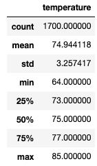
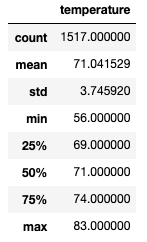

# Surfs Up

## Overview of Analysis
The purpose of this project is to analyze the temperature trends in Oahu, Hawaii for a hypothetical client seeking to open a surf shop. Specifically, the temperature trends during the months of June and December are analyzed so that the client can make a more informed decision.

## Results
### June
* The average temperature in Oahu during December is only 3.9°F cooler than June.
* The lowest temperature in December is 8°F colder than the lowest temperature in June.
* There are 10.7% less data points in December than June.

Below is a statistical summary for the month of June:

### December
Below is a statistical summary for the month of December:

## Summary

In conclusion, the data summarizes that a surf shop would be sustainable since the weather is warm enough in June and December with an average temperature being above 70 degrees. However, temperature should not be the only data incorporated for the final business decision. There are other attributes to the weather such as precipitation and average beach goers. With this extra data, we could run more queries to determine how we would like to build infrastructure of the shop and what areas would make this a more optimal location for visitors.
